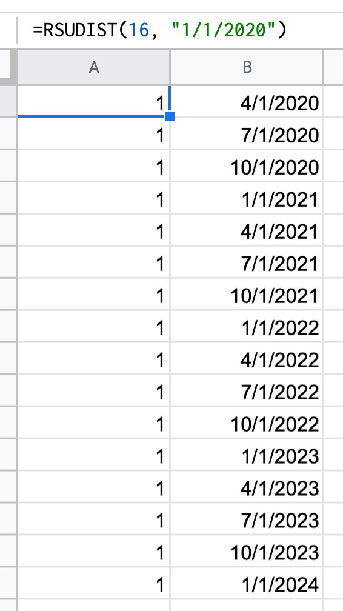
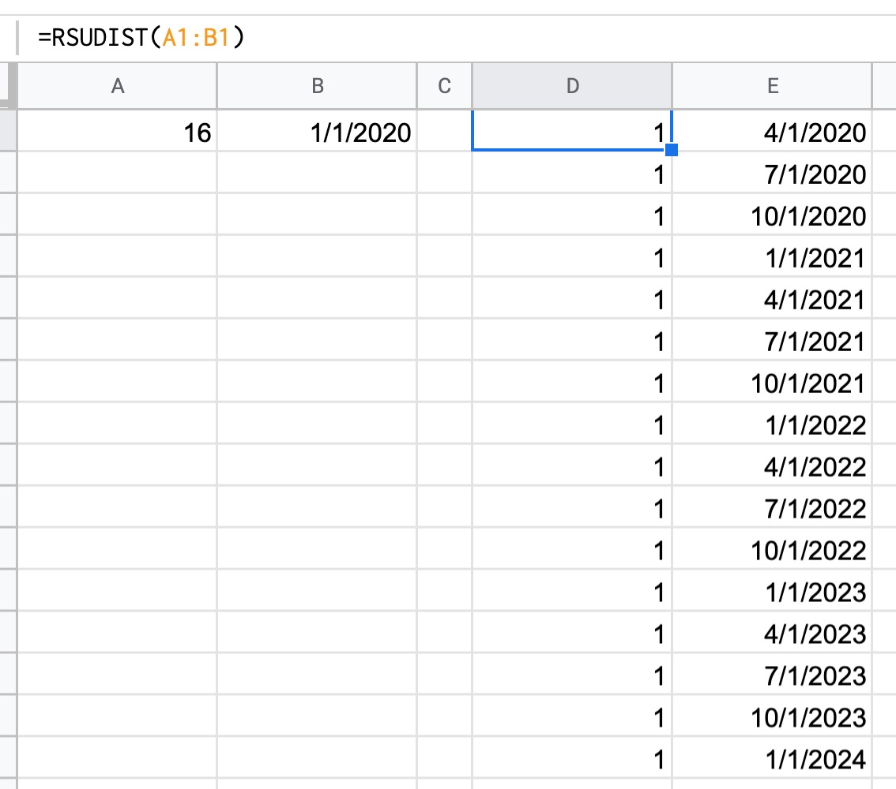
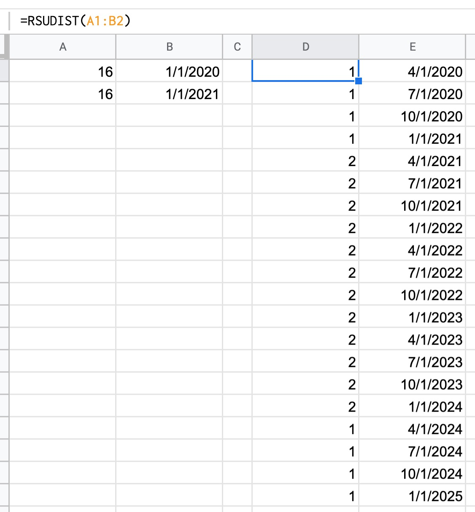

# rsudist

## Overview

This is the home of [some JavaScript][Code.js] that provides a [Custom
Function] for [Google Sheets] named `=RSUDIST`.

You provide information to `=RSUDIST()` about an equity grant:

* How many RSUs were granted?
* When do these RSUs begin to vest?

And it generates a schedule indicating distribution (vesting) events
for that equity.

## Why might you use `=RSUDIST`?

`=RSUDIST` makes reasoning about equity easier.

You can *only benefit* from better understanding any equity that has
been granted to you.

And Google Sheets is a good mechanism for exploring how vesting equity
and changing stock prices can impact you.

## Why would I share `=RSUDIST`?

I have had conversations about equity with people and wished for
something that is illustrative of possible outcomes in the way that
`=RSUDIST` is. If you are getting your first grant it can be somewhat
confusing.

I have known people that have disregarded compensation from equity
because they did not understand it, and I do not want anyone to make
that mistake if I can help it.

## How do you "get" `=RSUDIST`?

1. Create a new Google Sheet
2. Navigate to Tools > Script Editor (a new window will open)
3. Replace the default Script Editor content of `function myFunction {
   }` with the contents of [this file][Code.js].
4. Save your changes in the Script Editor
5. Navigate back to your Google Sheet
6. You should now be able to invoke `=RSUDIST()`. See below for three
   ways to verify that it is working as expected.

## How to use `=RSUDIST`?

It can be invoked with arguments directly: `=RSUDIST(16, "1/1/2020")`.

Alternatively, you could put `16` in a cell side-by-side `1/1/2020`
and you can pass in references to those cells: `=RSUDIST(A1:B1)`.

If you are in the fortunate situation where you have two grants, you
could describe each grant like above and then pass in a reference to
that range: `=RSUDIST(A1:B2)`.

In this situation, `=RSUDIST` will merge the results, and if vest
dates overlap the RSUs vested will be added together.

## Assumptions, Limitations, and a Warning

* `=RSUDIST` assumes a quarterly vesting schedule over 4 years.
* `=RSUDIST` (presently) does not model a year long cliff in any grant.

**Warning: `=RSUDIST` was created quickly during a vacation with
limited input, and I'm not convinced that it produces accurate
results.**

It could be valuable to you if you want to get a rough idea of how an
equity situation will change over time inside of a Google Sheet.

However, YOU MUST DOUBLE CHECK what it produces against the reality
defined by your financial institution.

In this regard, please pay particular attention to the part of the
[LICENSE] that reads:

> THE SOFTWARE IS PROVIDED "AS IS", WITHOUT WARRANTY OF ANY KIND,
> EXPRESS OR IMPLIED

## Future Development

I have submitted `=RSUDIST` to be a proper Google Sheets Add-on, but
I'm still working through what's required for that.

In the mean time, you can surely use/consume `=RSUDIST` as described
above.

If you are looking to fix bugs or add features so that they are merged
back in here, I suspect you should open an issue to describe what you
want.

I have a test suite for `=RSUDIST` that lives inside a Google Sheet--
and I would share that with anyone that wants to collaborate.

I will also consider converting this over to use [Clasp], but I'll
wait until I get through / give up on this becoming a proper Google
Sheet Add-on, first.

## In Closing

I think `=RSUDIST` can be useful and I'd ask that you please [create an
issue] if you see a problem.

Be well. Happy New Year.

[Code.js]: src/Code.js
[Google Sheets]: https://www.google.com/sheets/about/
[Custom Function]: https://developers.google.com/apps-script/guides/sheets/functions
[LICENSE]: ./LICENSE
[Clasp]: https://github.com/google/clasp
[create an issue]: https://github.com/jedcn/rsudist/issues/new
